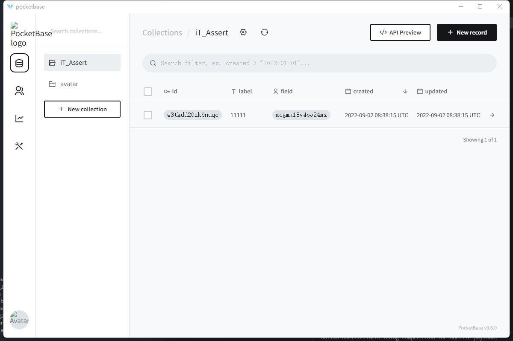

# pocketbase-py-gui
Gui for pocketbase  



Requirements:  
- Webview2 Runtime    

File Structure:  
```txt
- TopFolder  
+- app.exe  
+- config.ini  
+- pocketbase  
  +- pockectbase.exe
```


Build: `nuitka .\app.py --output-dir=.\build --onefile  --windows-icon-from-ico=.\logo.png --windows-disable-console`
